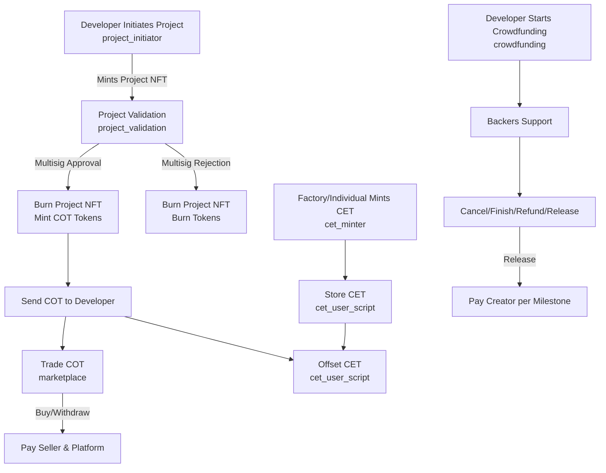

# Karbon-Umbrella Project Documentation

## Table of Contents

- [Overview](#overview)
- [Project Structure](#project-structure)
- [Key Components](#key-components)
  - [Configuration (`aiken.toml`)](#configuration-aikentoml)
  - [Constants (`lib/constants.ak`)](#constants-libconstantsak)
  - [Data Types (`lib/types/*.ak`)](#data-types-libtypesak)
  - [Utility Functions (`lib/functions/utils.ak`)](#utility-functions-libfunctionsutilsak)
  - [Validators (`validators/*.ak`)](#validators-validatorsak)
    - [1. `carbonica_validator.ak`](#1-carbonica_validatorak)
    - [2. `cet_minter.ak`](#2-cet_minterak)
    - [3. `cet_user_script.ak`](#3-cet_user_scriptak)
    - [4. `config_datum_holder.ak`](#4-config_datum_holderak)
    - [5. `crowdfunding.ak`](#5-crowdfundingak)
    - [6. `identification_nft.ak`](#6-identification_nftak)
    - [7. `marketplace.ak`](#7-marketplaceak)
- [Flow](#flow)
  - [Detailed Workflow](#detailed-workflow)
  - [Flowchart](#flowchart)
- [Glossary](#glossary)
- [Security Considerations](#security-considerations)
- [Deployment Instructions](#deployment-instructions)
- [Error Handling](#error-handling)
- [Example Use Case](#example-use-case)

## Overview

The `karbonumbrella` project, developed by `konma-org`, is a suite of Aiken-based smart contracts for the Cardano blockchain, leveraging Plutus v3. It enables carbon credit trading, crowdfunding, and marketplace functionalities, focusing on carbon emission tokens (CET) and carbon offset tokens (COT). The project includes validators for project validation, token minting, crowdfunding campaigns, and marketplace transactions, with a configuration system secured by an identification NFT.

This document provides a detailed overview of the project’s structure, components, functionality, workflow, and key terms.

## Project Structure

- **lib/**: Supporting modules for constants, utility functions, and data types.
  - `constants.ak`: Defines constants (e.g., `KARBON_IDENTIFICATION`, `royalty_amt`).
  - `functions/utils.ak`: Utility functions for validation and token handling.
  - `types/datum.ak`, `types/redeemer.ak`, `types/utils.ak`: Data types for datums, redeemers, and utilities.
- **validators/**: Smart contract validators:
  - `carbonica_validator.ak`: Project initiation and validation with multisig.
  - `cet_minter.ak`: Mints/burns CET and COT tokens.
  - `cet_user_script.ak`: Manages CET/COT user interactions.
  - `config_datum_holder.ak`: Stores configuration data and identification NFT.
  - `crowdfunding.ak`: Manages crowdfunding campaigns.
  - `identification_nft.ak`: Mints/burns identification NFTs.
  - `marketplace.ak`: Handles marketplace trading with royalties.
- **aiken.toml**: Project configuration with dependencies.
- **README.md**: Instructions for building, testing, and documentation.
- **.github/workflows/continuous-integration.yml**: CI pipeline.

## Key Components

### Configuration (`aiken.toml`)

- **Name**: `konma-org/karbonumbrella`
- **Version**: `0.0.0`
- **Compiler**: Aiken `v1.1.17`
- **Plutus Version**: `v3`
- **Dependencies**:
  - `aiken-lang/stdlib` (v2.2.0)
  - `logical-mechanism/assist` (v0.5.1)
- **Network ID**: 41

### Constants (`lib/constants.ak`)

- **Identification Token**: `"KARBON_IDENTIFICATION"`
- **Royalty Amount**: 3%
- **Royalty Address**: Wallet with a specific public key hash.

### Data Types (`lib/types/*.ak`)

- **ConfigDatum**: Fees, addresses, categories, multisig settings, CET/COT policy IDs.
- **ProjectDatum**: Developer, document, category, fees.
- **MarketplaceDatum**: Owner, amount.
- **CETDatum**: Location, quantity, time.
- **CampaignDatum**: Name, goal, deadline, creator, milestones, state.
- **BackerDatum**: Backer’s wallet.
- **Redeemers**: `Mint`, `Burn`, `Buy`, `Withdraw`, `CampaignAction` (`Support`, `Cancel`, `Finish`, `Refund`, `Release`).
- **Utilities**: `AssetClass`, `PaymentKeyHash`, `StakeKeyHash`, `AddressTuple`, `Multisig`.

### Utility Functions (`lib/functions/utils.ak`)

- `is_category_from_supported_categories`: Validates project categories.
- `must_send_nft_and_datum_to_script`: Ensures NFT and datum outputs.
- `must_burn_less_than_0`: Verifies token burning.
- `ref_datum_by_nft`: Retrieves configuration datum.
- `calculate_payout_royalty`: Splits marketplace payments (3% to platform).
- `must_reach_goal_and_send_to_creator`: Ensures crowdfunding payouts.

### Validators (`validators/*.ak`)

#### 1. `carbonica_validator.ak`

- **Purpose**: Manages project initiation and validation.
- **Contracts**:
  - **Project Initiator**: Mints project NFTs, ensuring valid categories and fees.
  - **Project Validation**: Approves/rejects projects with multisig, mints COT tokens on approval.
- **Logic**:
  - Initiation: Verifies category and sends NFT to validation contract.
  - Validation: Burns NFT; mints COT on approval, burns tokens on rejection.

#### 2. `cet_minter.ak`

- **Purpose**: Mints/burns CET and COT tokens.
- **Logic**:
  - Mints CET with matching datum and quantity.
  - Burns CET and COT in equal quantities for offsetting.
- **Redeemer**: `CETDatum` (mint), `EmissionBurnRedeemer` (burn).

#### 3. `cet_user_script.ak`

- **Purpose**: Manages CET/COT for users.
- **Logic**:
  - Burns CET and COT equally.
  - Allows COT withdrawal.
  - Tokens are non-transferable, only burnable.
- **Redeemer**: 0 (burn), 1 (withdraw).

#### 4. `config_datum_holder.ak`

- **Purpose**: Stores configuration datum and identification NFT.
- **Logic**: Requires multisig to spend.

#### 5. `crowdfunding.ak`

- **Purpose**: Manages crowdfunding campaigns.
- **Actions**:
  - **Support**: Backers contribute and receive reward tokens.
  - **Cancel**: Cancels campaign (creator or platform).
  - **Finish**: Marks campaign as finished, burns tokens.
  - **Refund**: Refunds backers in cancelled campaigns.
  - **Release**: Releases funds per milestone.
- **Logic**:
  - Ensures future deadlines and unset milestones.
  - Verifies signatures and state transitions.

#### 6. `identification_nft.ak`

- **Purpose**: Mints/burns identification NFT for configuration reference.
- **Logic**: Mints one NFT or burns it.

#### 7. `marketplace.ak`

- **Purpose**: Facilitates COT trading with royalties.
- **Actions**:
  - **Buy**: Pays seller and platform (3% royalty).
  - **Withdraw**: Seller withdraws funds.
- **Logic**: Ensures correct payouts and signatures.

## Flow

The `karbonumbrella` project orchestrates a workflow for carbon credit management, project validation, crowdfunding, and trading. Below is a detailed explanation, followed by a flowchart.

### Detailed Workflow

1. **Project Initiation**:

   - A developer initiates a project via the `project_initiator` contract in `carbonica_validator.ak`.
   - The project is submitted with a `ProjectDatum` (category, developer, fees, etc.).
   - The contract checks if the category is supported (`is_category_from_supported_categories`) and mints a unique project NFT.
   - The NFT and associated datum are sent to the `project_validation` contract, along with fees to the configured address.

2. **Project Validation**:

   - A group of validators, defined in the `ConfigDatum`’s `multisig_validator_group`, reviews the project via the `project_validation` contract.
   - **Approval** (`action: 0`):
     - Requires multisig signatures (`verify_multisig`).
     - Burns the project NFT.
     - Mints COT tokens, derived from the output reference (`token_name_oref`), and sends them to the developer’s address (`payout.exact`).
   - **Rejection** (`action: 1`):
     - Requires multisig signatures.
     - Burns the project NFT and any associated tokens.
   - The `ConfigDatum` is referenced via the identification NFT (`KARBON_IDENTIFICATION`) to retrieve multisig settings.

3. **CET Minting**:

   - Factories, industries, or individuals mint CET tokens through the `cet_minter` contract.
   - A `CETDatum` (location, quantity, time) is provided as the redeemer.
   - The contract mints CET tokens and sends them to the `cet_user_script` address, ensuring the datum matches the redeemer and the quantity is correct.
   - CET tokens represent carbon emissions and are non-transferable, stored in `cet_user_script`.

4. **CET/COT Offsetting**:

   - Users offset emissions by burning CET and COT tokens via the `cet_user_script` contract.
   - The redeemer (`0`) triggers burning, ensuring equal quantities of CET and COT are burned (`cet_qty == cot_qty`).
   - Remaining COT tokens, if any, are sent back to the user’s script address (`must_send_remaining_token_to_addr`).
   - CET and COT tokens cannot be transferred, only burned or withdrawn (COT only).

5. **Marketplace Trading**:

   - Developers trade COT tokens on the marketplace (`marketplace.ak`).
   - **Buy**:
     - A buyer purchases COT tokens, triggering a `Buy` redeemer.
     - The contract splits the payment: 3% royalty to the platform (`roylaty_addr`) and the remainder to the seller (`calculate_payout_royalty`).
   - **Withdraw**:
     - The seller withdraws funds with a `Withdraw` redeemer, requiring their signature.
   - The `MarketplaceDatum` tracks ownership and amounts.

6. **Crowdfunding**:

   - Developers raise funds via the `crowdfunding` contract.
   - A campaign is created with a `CampaignDatum` (name, goal, deadline, milestones, etc.), minting reward tokens.
   - **Support**: Backers contribute funds and receive reward tokens proportional to their contribution.
   - **Cancel**: The creator or platform cancels the campaign, refunding backers.
   - **Finish**: Marks the campaign as completed, burning reward tokens.
   - **Refund**: Refunds backers in a cancelled campaign.
   - **Release**: Releases funds to the creator per milestone, updating the `milestone` list.
   - State transitions (`Initiated`, `Running`, `Cancelled`, `Finished`, `Released`) are validated with signatures.

### Flowchart

## Glossary

- **CET (Carbon Emission Token)**: A token representing carbon emissions, minted by factories or individuals, non-transferable, and burnable for offsetting.
- **COT (Carbon Offset Token)**: A token representing carbon offsets, minted upon project approval, tradable in the marketplace, and burnable for offsetting.
- **ConfigDatum**: A data structure storing platform configuration (fees, addresses, multisig settings, policy IDs).
- **Identification NFT**: A unique NFT (`KARBON_IDENTIFICATION`) used to reference the `ConfigDatum` in transactions.
- **Multisig**: Multi-signature validation requiring a minimum number of signatures from a group of validators.
- **Project NFT**: A unique token representing a project during validation, burned upon approval or rejection.
- **ProjectDatum**: Data structure for project details (developer, category, fees).
- **MarketplaceDatum**: Data structure for marketplace transactions (owner, amount).
- **CampaignDatum**: Data structure for crowdfunding campaigns (name, goal, deadline, milestones, state).
- **BackerDatum**: Data structure representing a backer’s wallet in crowdfunding.
- **Redeemer**: A data input to a validator specifying the action (e.g., `Mint`, `Burn`, `Buy`, `Support`).
- **Royalty**: A 3% fee paid to the platform in marketplace transactions.
- **Milestone**: A boolean list in `CampaignDatum` tracking crowdfunding progress, updated upon fund release.

## Security Considerations

- **Multisig Validation**: The `project_validation`, `config_datum_holder`, and `crowdfunding` contracts use multisig to ensure trusted parties approve critical actions, reducing single-point failures.
- **Non-Transferable Tokens**: CET tokens in `cet_user_script` are non-transferable, preventing unauthorized trading and ensuring they are only used for offsetting.
- **Datum Validation**: Functions like `ref_datum_by_nft` and `must_send_nft_and_datum_to_script` enforce correct datum types, preventing malformed inputs.
- **Potential Risks**:
  - **Invalid Redeemers**: Validators use `fail` for unexpected redeemers (e.g., `cet_minter` fails on invalid redeemer types), but off-chain code must ensure correct inputs.
  - **Signature Spoofing**: Multisig relies on Cardano’s `verify_multisig`; compromised validator keys could allow unauthorized approvals.
  - **Hardcoded Constants**: Values like `royalty_amt` and `roylaty_addr` are hardcoded, posing risks if not updated securely via `config_datum_holder`.

## Error Handling

Validators use `fail` to halt execution on invalid conditions, ensuring robust behavior:

- **Common Failures**:
  - `No Datum On Input` (`utils.ak`): Triggered if an input lacks an inline datum.
  - `Invalid Redeemer` (`cet_minter.ak`): Fails on unexpected redeemer types.
  - `Incorrect Stake Component` (`utils.ak`): Ensures correct address credentials.
- **Protection**:
  - Explicit checks (e.g., `expect`) prevent invalid state transitions.
  - Multisig requirements in `crowdfunding` and `project_validation` block unauthorized actions.
  - Token quantity checks (`must_burn_less_than_0`) ensure correct minting/burning.

## Example Use Case

**Scenario**: A developer, Alice, proposes a reforestation project, validates it, trades COT, and raises funds.

1. **Initiate Project**:
   - Alice submits a `ProjectDatum` (category: "forestry", fees: 100 ADA) via `project_initiator`.
   - A project NFT is minted and sent to `project_validation`.
2. **Validation**:
   - Validators approve the project with multisig signatures.
   - The NFT is burned, and 1000 COT tokens are minted and sent to Alice’s wallet.
3. **Trade COT**:
   - Alice lists 500 COT on the marketplace (`marketplace.ak`).
   - Bob buys them for 5000 ADA; 3% (150 ADA) goes to the platform, and Alice receives 4850 ADA.
4. **Offset Emissions**:
   - A factory mints 200 CET tokens via `cet_minter` and stores them in `cet_user_script`.
   - They burn 200 CET and 200 COT (purchased from Alice) to offset emissions.
5. **Crowdfunding**:
   - Alice starts a campaign (`crowdfunding.ak`) with a 10,000 ADA goal and three milestones.
   - Backers contribute 12,000 ADA, receiving reward tokens.
   - After the first milestone, Platform releases 4000 ADA with Multisig approval.
