Decision Tree for Konmaorg-Generic System

1. Project Initiation

   - Is the project category valid (in ConfigDatum.categories)?
     - Yes: Proceed to pay platform fee
       - Is the platform fee paid (exact amount to fees_address)?
         - Yes: Mint project NFT
           - Is NFT sent to validator contract with ProjectDatum?
             - Yes: Project submitted (Success)
             - No: Fail (Invalid NFT output)
         - No: Fail (Incorrect fee)
     - No: Fail (Invalid category)

2. Project Validation

   - Is the transaction signed by multisig (ConfigDatum.multisig_validator_group)?
     - Yes: Is the action to approve (redeemer.action == 0)?
       - Yes: Burn project NFT
         - Are credit tokens minted and sent to initiator?
           - Yes: Validation success
           - No: Fail (Invalid credit token output)
       - No (reject, redeemer.action == 1): Burn project NFT
         - Are associated tokens burned?
           - Yes: Validation rejected
           - No: Fail (Invalid burn)
     - No: Fail (Unauthorized)

3. Asset Token Minting

   - Is the redeemer an AssetDatum?
     - Yes: Does the minted quantity match AssetDatum.asset_qty?
       - Yes: Are tokens sent to user script with matching datum?
         - Yes: Minting success
         - No: Fail (Invalid output)
       - No: Fail (Quantity mismatch)
     - No (AssetBurnRedeemer): Are asset and credit tokens burned equally?
       - Yes: Burning success
       - No: Fail (Unequal burn)

4. Asset/Credit Reconciliation

   - Is redeemer == 0 (burn)?
     - Yes: Are asset and credit tokens burned in equal quantities?
       - Yes: Are remaining tokens sent to user script?
         - Yes: Reconciliation success
         - No: Fail (Invalid output)
       - No: Fail (Unequal burn)
     - No (redeemer == 1, withdraw): Not implemented
       - Fail (Invalid redeemer)

5. Marketplace Trading

   - Is redeemer Buy?
     - Yes: Is seller paid (amount - 3%) and platform paid 3% royalty?
       - Yes: Trade success
       - No: Fail (Incorrect payout)
     - No (Withdraw): Is transaction signed by owner?
       - Yes: Withdraw success
       - No: Fail (Unauthorized)

6. Crowdfunding

   - Action: Initiate Campaign
     - Are goal > 0 and deadline in future?
       - Yes: Are all milestones unset (False)?
         - Yes: Are reward tokens minted and sent to campaign address?
           - Yes: Campaign initiated
           - No: Fail (Invalid token output)
         - No: Fail (Invalid milestones)
       - No: Fail (Invalid goal/deadline)
   - Action: Support
     - Is campaign in Running state?
       - Yes: Does backer’s contribution match reward tokens?
         - Yes: Are reward tokens sent to backer and campaign datum unchanged?
           - Yes: Support success
           - No: Fail (Invalid output)
         - No: Fail (Invalid contribution)
       - No: Fail (Invalid state)
   - Action: Cancel
     - Is transaction signed by creator or platform (post-deadline)?
       - Yes: Is campaign in Running state?
         - Yes: Is state set to Cancelled?
           - Yes: Cancel success
           - No: Fail (Invalid datum)
         - No: Fail (Invalid state)
       - No: Fail (Unauthorized)
   - Action: Finish
     - Is transaction signed by creator or platform (post-deadline if platform)?
       - Yes: Is campaign in Running state and goal met?
         - Yes: Is state set to Finished and tokens burned?
           - Yes: Finish success
           - No: Fail (Invalid output)
         - No: Fail (Invalid state or goal)
       - No: Fail (Unauthorized)
   - Action: Refund
     - Is campaign in Cancelled state?
       - Yes: Is backer refunded and tokens burned?
         - Yes: Refund success
         - No: Fail (Invalid refund)
       - No: Fail (Not cancelled)
   - Action: Release
     - Is campaign in Finished state and multisig signed?
       - Yes: Is milestone updated and creator paid?
         - Yes: Release success
         - No: Fail (Invalid payout)
       - No: Fail (Unauthorized or invalid state)

7. DAO Governance
   - Action: Submit Proposal
     - Is transaction signed by submitter?
       - Yes: Is proposal NFT minted and state InProgress?
         - Yes: Proposal submitted
         - No: Fail (Invalid output)
       - No: Fail (Unauthorized)
   - Action: Vote
     - Is proposal in InProgress and before deadline?
       - Yes: Is voter authorized and hasn’t voted?
         - Yes: Is vote recorded and count incremented?
           - Yes: Vote success
           - No: Fail (Invalid output)
         - No: Fail (Unauthorized or already voted)
       - No: Fail (Invalid state or deadline)
   - Action: Execute
     - Is proposal in InProgress and after deadline?
       - Yes: Are Yes votes > No votes?
         - Yes: Is ConfigDatum updated and state Executed?
           - Yes: Execution success
           - No: Fail (Invalid update)
         - No: Fail (Not approved)
       - No: Fail (Invalid state or deadline)
   - Action: Reject
     - Is proposal in InProgress and after deadline?
       - Yes: Are No votes > Yes votes?

```mermaid
graph TD
    A[Start: System Interaction] --> B[Initiate Project]

    %% Project Initiation
    B -->|Submit Project| C{Valid Category?}
    C -->|Yes| D[Pay Platform Fee]
    C -->|No| E[Fail: Invalid Category]
    D --> F[Mint Project NFT]
    F --> G[Send NFT to Validator Contract]
    G --> H[Project Submitted]

    %% Project Validation
    H --> I[Validate Project]
    I -->|Multisig Review| J{Approved?}
    J -->|Yes| K[Burn Project NFT]
    K --> L[Mint Credit Tokens]
    L --> M[Send Credit Tokens to Initiator]
    M --> N[Validation Success]
    J -->|No| O[Burn Project NFT]
    O --> P[Burn Associated Tokens]
    P --> Q[Validation Rejected]

    %% Asset Token Minting
    A --> R[Mint Asset Tokens]
    R --> S{Valid Datum & Quantity?}
    S -->|Yes| T[Send Asset Tokens to User Script]
    T --> U[Asset Minting Success]
    S -->|No| V[Fail: Invalid Mint]

    %% Asset/Credit Reconciliation
    A --> W[Reconcile Tokens]
    W --> X{Burn Equal Asset & Credit Tokens?}
    X -->|Yes| Y[Send Remaining Tokens to User Script]
    Y --> Z[Reconciliation Success]
    X -->|No| AA[Fail: Unequal Burn]

    %% Marketplace Trading
    A --> AB[Trade Credit Tokens]
    AB --> AC{Action: Buy or Withdraw?}
    AC -->|Buy| AD{Pay Seller & 3% Royalty?}
    AD -->|Yes| AE[Transfer Credit Tokens]
    AE --> AF[Trade Success]
    AD -->|No| AG[Fail: Incorrect Payout]
    AC -->|Withdraw| AH{Signed by Owner?}
    AH -->|Yes| AI[Withdraw Funds]
    AI --> AJ[Withdraw Success]
    AH -->|No| AK[Fail: Unauthorized]

    %% Crowdfunding
    A --> AL[Start Crowdfunding]
    AL --> AM{Valid Goal & Deadline?}
    AM -->|Yes| AN[Mint Reward Tokens]
    AN --> AO[Send Tokens to Campaign Address]
    AO --> AP[Campaign Initiated]
    AM -->|No| AQ[Fail: Invalid Campaign]
    AP --> AR[Backer Support]
    AR --> AS{Sufficient Funds & Tokens?}
    AS -->|Yes| AT[Send Reward Tokens to Backer]
    AT --> AU[Support Success]
    AS -->|No| AV[Fail: Invalid Support]
    AP --> AW{Action: Cancel, Finish, Refund, Release?}
    AW -->|Cancel| AX{Signed by Creator or Platform Post-Deadline?}
    AX -->|Yes| AY[Set State to Cancelled]
    AY --> AZ[Cancel Success]
    AX -->|No| BA[Fail: Unauthorized Cancel]
    AW -->|Finish| BB{Signed by Creator or Platform & Goal Met?}
    BB -->|Yes| BC[Set State to Finished]
    BC --> BD[Burn Reward Tokens]
    BD --> BE[Finish Success]
    BB -->|No| BF[Fail: Invalid Finish]
    AW -->|Refund| BG{Campaign Cancelled?}
    BG -->|Yes| BH[Refund Backer & Burn Tokens]
    BH --> BI[Refund Success]
    BG -->|No| BJ[Fail: Not Cancelled]
    AW -->|Release| BK{Campaign Finished & Multisig Signed?}
    BK -->|Yes| BL[Update Milestone & Pay Creator]
    BL --> BM[Release Success]
    BK -->|No| BN[Fail: Invalid Release]

    %% DAO Governance
    A --> BO[Submit DAO Proposal]
    BO --> BP{Signed by Submitter?}
    BP -->|Yes| BQ[Mint Proposal NFT]
    BQ --> BR[Set State to InProgress]
    BR --> BS[Proposal Submitted]
    BP -->|No| BT[Fail: Unauthorized]
    BS --> BU[Vote on Proposal]
    BU --> BV{Voter Authorized & Before Deadline?}
    BV -->|Yes| BW[Record Vote]
    BW --> BX[Vote Success]
    BV -->|No| BY[Fail: Invalid Vote]
    BS --> BZ{After Deadline?}
    BZ -->|Yes| CA{Yes Votes > No Votes?}
    CA -->|Yes| CB[Execute Proposal]
    CB --> CC[Update ConfigDatum]
    CC --> CD[Execution Success]
    CA -->|No| CE[Reject Proposal]
    CE --> CF[Set State to Rejected]
    CF --> CG[Rejection Success]
    BZ -->|No| CH[Continue Voting]

    %% End Points
    E --> ZZZ[End: Failure]
    Q --> ZZZ
    V --> ZZZ
    AA --> ZZZ
    AG --> ZZZ
    AK --> ZZZ
    AQ --> ZZZ
    AV --> ZZZ
    BA --> ZZZ
    BF --> ZZZ
    BJ --> ZZZ
    BN --> ZZZ
    BT --> ZZZ
    BY --> ZZZ
    N --> ZZZZ[End: Success]
    U --> ZZZZ
    Z --> ZZZZ
    AF --> ZZZZ
    AJ --> ZZZZ
    AU --> ZZZZ
    AZ --> ZZZZ
    BE --> ZZZZ
    BI --> ZZZZ
    BM --> ZZZZ
    BX --> ZZZZ
    CD --> ZZZZ
    CG --> ZZZZ
```

